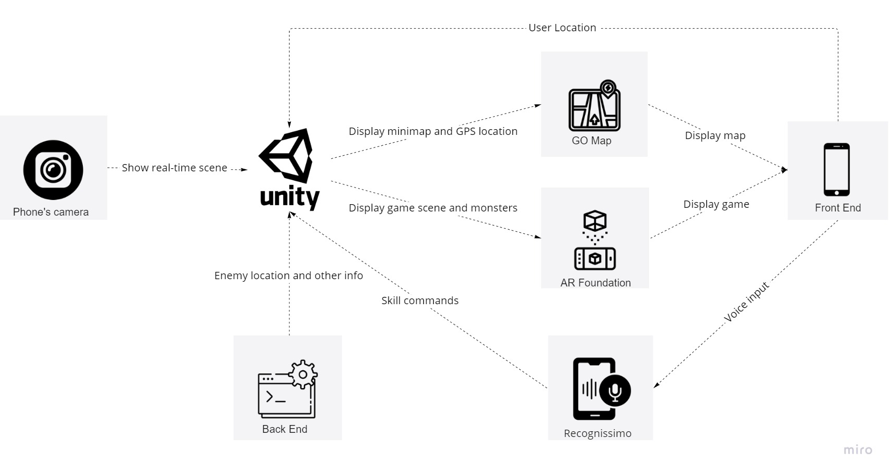

## VE441 Team: FantasyAR

|                          Gradesheet                          |                          Team Info                           |                             Demo                             |                             Wiki                             |                            Trello                            |
| :----------------------------------------------------------: | :----------------------------------------------------------: | :----------------------------------------------------------: | :----------------------------------------------------------: | :----------------------------------------------------------: |
| [][grade_sheet] | [][team_contract] | [][demo_page] | [][wiki_page] | [][process_page] |

[grade_sheet]: https://docs.google.com/spreadsheets/d/1X3MaZ2m3UsdjcJARJQvdTjxElceTxeJx2uY92idq3xk/edit?usp=sharing
[team_contract]: https://docs.google.com/document/d/1YL6lX2RmaLtHDfeRCVXXIFOjAGVMu9O5j3gxOPFHA2Y/edit?usp=sharing
[demo_page]: https://www.youtube.com/watch?v=VIcOGEhsXGM&feature=youtu.be
[wiki_page]: https://github.com/eecs441staff/441template/wiki
[process_page]: https://trello.com/b/MyPhHMGd/441template

### Getting Started

#### List of front-end and back-end dependencies

| Name                | Link                                                         |
| ------------------- | ------------------------------------------------------------ |
| Unity AR Foundation | https://unity.com/unity/features/ar                          |
| GoMap               | https://assetstore.unity.com/packages/tools/integration/go-map-3d-map-for-ar-gaming-68889 |
| AR+GPS location     | https://assetstore.unity.com/packages/tools/integration/ar-gps-location-134882 |
| Recognissimo        | https://assetstore.unity.com/packages/tools/audio/recognissimo-cross-platform-offline-speech-recognition-203101 |
| Nginx               | https://www.nginx.com/                                       |
| Django              | https://www.djangoproject.com/                               |
| Gunicorn            | https://gunicorn.org/                                        |

### Model and Engine

#### Storymap

The following pictures shows our story map.

#### Block Diagram

The following picture is our engine architecture.

We use Unity as our game engine.  Firstly, the front end provides the user location to the unity. With that information, unity can display the map and user avatar with the GO Map. Secondly, the front end provides the voice input, then Recognissimo will transfer it into a string in unity that acts as skill commands. Finally, the back end provides the enemy location to the unity, and with the scene captured by the phone's camera, AR+GPS location API will generate a game scene with the enemy in the real-time scene.

### APIs and Controller

GO Map, AR+GPS location, and Recognissimo are downloaded from the unity asset store. They are packed perfectly and can communicate with the unity game engine automatically.

1. The first third-party API is GO Map. It can display the map in the real world based on user location, similar to Google Maps but with a game-style look. It will serve as a minimap that indicates to the player where the enemy or new missions are. The input for GO Map is the user location provided by GPS, the output is the minimap as well as the player avatar in the unity engine.

2. The second API is AR+GPS location. It can display AR models at specific locations as if the model is live in the scene captured by the camera. The input is the location of the monster in the real world, the output is to instantiate a monster model at that point in the unity engine.

3. The third API is Recognissimo, which is used for voice recognition. With the voice input by the user, it can convert the input into strings in unity. And then, skill commands in the game will be activated accordingly. The input is the user's voice, and the output is a string type to the unity engine.

The APIs used in the backend are shown below:

#### GetEnemyLocation

This function is to ensure that multiple players will see the same enemy in one location so that they can cooperate online.

**Request Parameters**

| Name           | Type    | Description                |
| -------------- | ------- | -------------------------- |
| PlayerLocation | Vector3 | The location of the player |

**Return Parameters**

| Name           | Type           | Description                             |
| -------------- | -------------- | --------------------------------------- |
| EnemyLocations | List<Vector3\> | The location of enemies near the player |
| EnemyTypes     | List<int\>     | The corresponding enemy type index      |

#### GetPlayerLevel

This function is used to get the player level that will be used for the scoreboard.

**Request Parameters**

| Name     | Type | Description             |
| -------- | ---- | ----------------------- |
| PlayerID | int  | Unique ID of the player |

**Return Parameters**

| Name  | Type | Description                     |
| ----- | ---- | ------------------------------- |
| Level | int  | The current level of the player |

#### GetPlayerSkill

This function is used to get the skills that the player has mastered.

**Request Parameters**

| Name     | Type | Description             |
| -------- | ---- | ----------------------- |
| PlayerID | int  | Unique ID of the player |

**Return Parameters**

| Name   | Type       | Description           |
| ------ | ---------- | --------------------- |
| Skills | List<int\> | A List of skill index |

### View UI/UX

The overview of UI/UX. It includes four major parts: Start game and view map, AR battle, Practice mode and Change weapons and skills.

#### Start game and view map

In this flow, the player can start the game, view real-time 3D map and view monster locations on the map.

#### AR battle

In this flow, the player can shoot the monster, use skills by voice control, gain experience and coins after battle and quit battle.

#### Pratice mode

This flow is similar to the AR battle. The difference is that player should place a monster on a plane first and player do not gain experience and coins after battle.

#### Change weapons and skills

In this flow, the player can view status (level, coins), change weapons and skills.

#### Final Design Justification

The change is that we made the crosshair at the center of the battle scene less obvious and made the size of the shoot button larger with a bold border line.

**Mockup Usability Test results**

| Tasks                           | Evaluation Metrics | Evaluation Metrics(% success) |
| ------------------------------- | ------------------ | ----------------------------- |
| Shoot the monster for one time. | ≤ 5 seconds.       | 33                            |

We only list the result of the major fault in the original design. No changes to other UI elements, because more than 80% of the participants did well in other tests. 

For the complete results of usability testing, please see the [google slides](https://docs.google.com/presentation/d/1Lx3SiQz4-HtTHlB96S4Q2PONFLGE1FXCIjDZi7XFGIE/edit?usp=sharing) for details.

### Team Roster

Name: Qihan Ren

Contribution:

- Project manager
- Voice control of skills
- Place a monster on the plane (partial participation, mainly debugging the instantiation of the monster)
- Monster moving AI (partial participation, mainly debugging the monster navigation system)
- Monster attacking (projectile, can be dodged)
- Game over (player death)

Name: Zesheng Yu

Contribution:

- Set up the back-end server and the database for monsters' information
- Implement the API for random generating reasonable monsters within the neighbor of user's location
- Implement the API for removing monsters from database when the battling is ended
- Communicate with front-end to place monster at specific places

Name: Yanjun Chen

Contribution:

- Process map api and 3D Map display
- Place a monster on the plane
- Communicate with back-end to place monster at specific places
- Explore method to combine GPS and AR.

Name: Zhongqian Duan

Contribution:

- Monster model / animation / moving AI

- Skill effect (Fireball and icelance)

- Gun system

- Health and Damage system (partial participation, link damage to skill and gun)

  

Name: Yangdong Huang

Contribution:

- Monster placement on a plane in the practice mode (creation of AR session and plane detection)
- Player shooting (partial participation, mainly interaction with game loop control)
- Monster health system
- Practice mode game loop
- Graphical User Interface (buttons and success screen)

**Note: Only the backend code is pushed to github. Code for other features are on Plastic SCM.**
